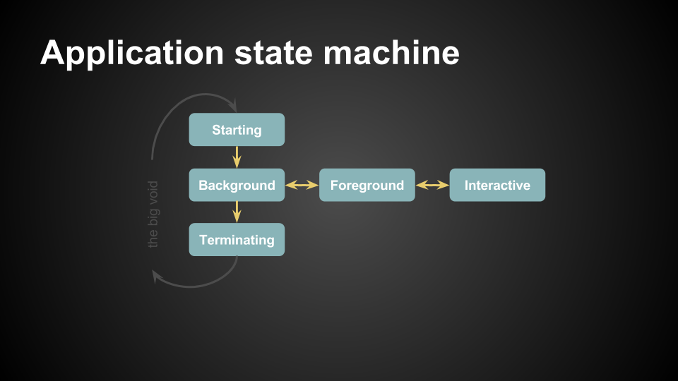

# Reacting to life-cycle events

Life-cycle events lets you respond to events such as the app being suspended, opened, closed and so on.

In this example, we will create an app that listens to life-cycle events, and reacts to them.

To listen to life-cycle events, import `FuseJS/Lifecycle` using `require`, and subscribe to events by setting your own functions as the event handlers.

## Losing and gaining control

The events `onEnteringInteractive` and `onExitedInteractive` are used to handle loss and gain of control. On desktop, this would fire when you loose/gain focus of the app's window. On mobile devices, they will fire when something else is overlaying the app on the screen(f.ex the notification bar on Android, or the overlaying chat window from Facebook Messenger. Note that the app is still running in the background in these two examples)

```
Lifecycle.onEnteringInteractive = function(){
    focused.value = true;
};

Lifecycle.onExitedInteractive = function(){
    focused.value = false;
};
```

## App entrance and exit

The events `onEnteringForeground` and `onEnteringBackground` are called when the app starts/resumes, or is suspended.

```
Lifecycle.onEnteringForeground = function() {
    console.log("Hello!");
}

Lifecycle.onEnteringBackground = function() {
    console.log("See you later!");
}
```

## App termination

The event `onTerminating` is called when the app is about to be terminated.

```
Lifecycle.onTerminating  = function() {
    console.log("Goodbye!");
}
```

Here is an illustration of how the different app-states relates to each other:



Take a look at the [JavaScript documentation](https://www.fusetools.com/learn/fusejs#lifecycle) for more details.

## The JavaScript

```
var Observable = require('FuseJS/Observable');
var Lifecycle = require('FuseJS/Lifecycle');

var focused = Observable(true);

Lifecycle.onEnteringInteractive = function(){
    focused.value = true;
};

Lifecycle.onExitedInteractive = function(){
    focused.value = false;
};

Lifecycle.onTerminating  = function() {
    console.log("Goodbye!");
}

Lifecycle.onEnteringForeground = function() {
    console.log("Hello!");
}

Lifecycle.onEnteringBackground = function() {
    console.log("See you later!");
}

module.exports = {
    focused: focused
};
```

## The UX

```
<App Theme="Basic">
	<Panel>
		<JavaScript File="MainView.js" />
		<SolidColor ux:Name="backgroundColor" Color="#4CAF50" />
		<WhileFalse Value="{focused}">
			<Change backgroundColor.Color="#FF9800" Duration=".5" />
		</WhileFalse>
	</Panel>
</App>
```
