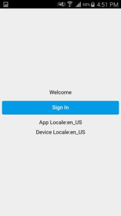

# Localization

This sample shows how to get the device locale and then display that language, if supported, or fallback to the app's default language using a custom `NativeModule` called `Localization`.

## How To Use

In JavaScript basic usage would look like the following:

```JavaScript
var locale = require("Localization").getCurrentLocale();

module.exports = {
	locale: locale
};
```

In `UX` basic usage would like the following:

```XML
<App Theme="Basic">
	<Localization ux:Global="Localization" />
	<ClientPanel>
		<JavaScript File="MainView.js" />
		<StateGroup Active="{locale}">
			<State Name="en_US">
				<ResourceString Key="keyHello" Value="Hello"/>
			</State>
			<State Name="zh_CN">
				<ResourceString Key="keyHello" Value="你好"/>
			</State>
		</StateGroup>
		<Text Value="{Resource keyHello}" Alignment="Center" />
	</ClientPanel>
</App>
```

## Notes

Each OS returns a string in a unique format and will need to be managed within your app. See `MainView.js` for a basic example of this. The differences are outlined below:

### Android
Will retrun: [two-letter lowercase language code (ISO 639-1)]_[two-letter uppercase country code (ISO 3166-1)]  
**For example:** `en_US` or `zh_CN`  
More details can be found here: 
* http://developer.android.com/reference/java/util/Locale.html

### iOS
Will return: [language designator]-[script designator]-\[region designator\]  
**For example:** `zh-Hans-US` or `en-US`  
More details can be found here:
* https://developer.apple.com/library/ios/documentation/MacOSX/Conceptual/BPInternational/LanguageandLocaleIDs/LanguageandLocaleIDs.html
* https://developer.apple.com/library/ios/technotes/tn2418/_index.html


### Windows / Mac
Will return the value `"Default"`. You can change this value in `Localization.uno` or manage it in your JavaScript.


## Screenshots



